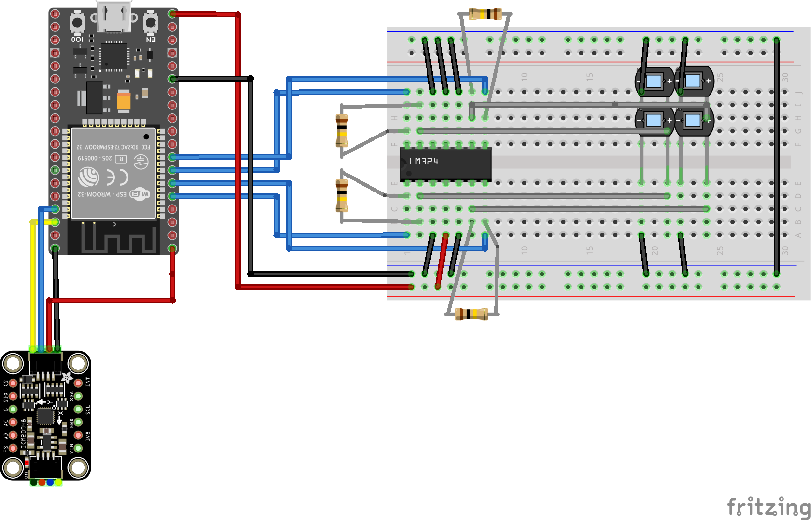
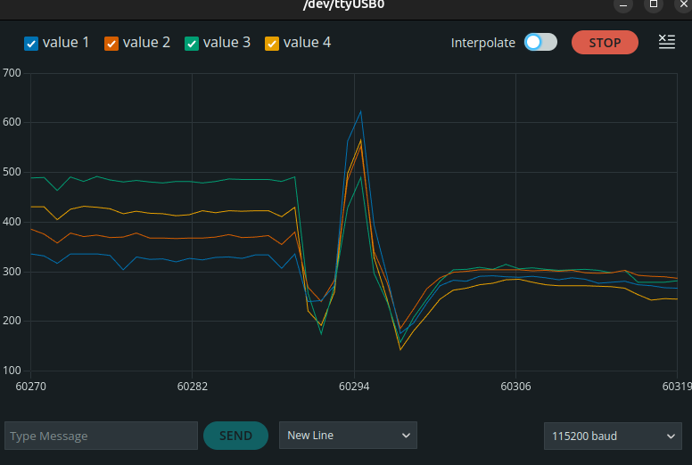
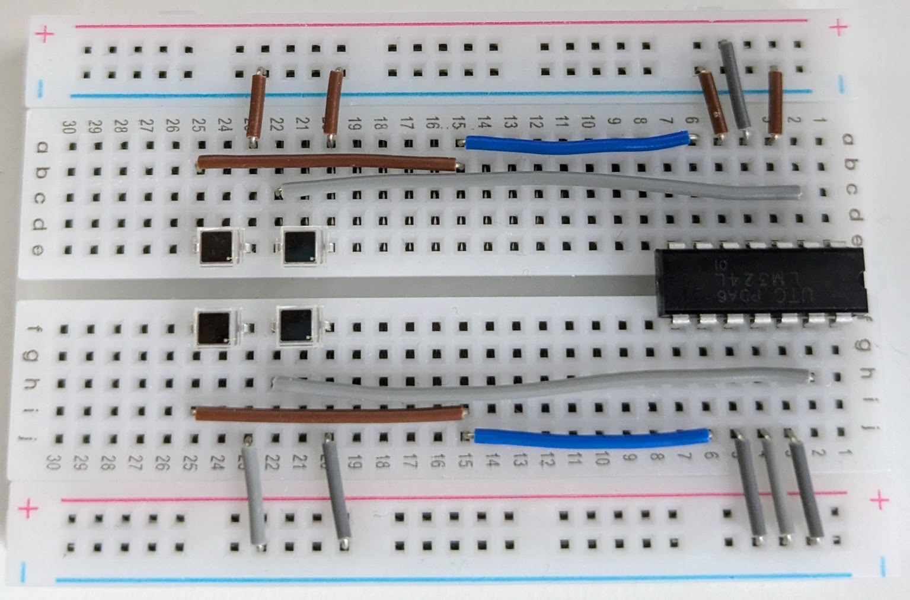
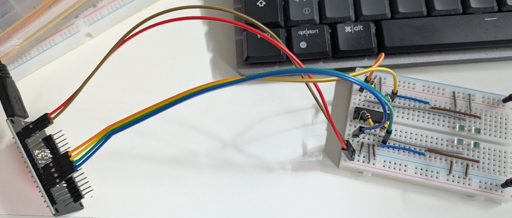

# Sky Polarization Measurement

## Idea
Use four photodiodes with linear polarization filters attached on top with 0°, 45°, 90°, 135° rotation respectively.

From the relative intensities of the measured illumination it is then possible to determine the polarization direction and strength of a light source.

Adding a long tube as a "collimator" along the surface normal of the photodiodes will enable to sample small patches of the sky.

Combining this setup with a 9dof sensor-fusion IMU recording the alt-az and rotation of the tube it is then possible to sway the tube around and continuously record polarization strength/direction to sample the whole sky.

This can be compared to the [Rayleigh sky polarization model](https://en.wikipedia.org/wiki/Rayleigh_sky_model).

## Description
This project uses an ESP32 microcontroller and four BPW34 photodiodes to measure the polarization of the sky. The ESP32 runs a local Wi-Fi access point and serves a JSON API of real-time light intensity values. The analog signals are read using a transimpedance amplifier (TIA) configuration with LM324 op-amps.

## Hardware
### Components
* Espressif ESP32 development board (1x)
* BPW 34 photodiodes (OSRAM) (4x)
* LM 324 Transimpedance amplifier
* GY-9250 9Axis IMU / Adafruit ICM-20948 9-DoF
* Feedback resistors (100&nbsp;kΩ - 1&nbsp;MΩ) (4x)

### Wiring

#### BPW34 / LM324
Each BPW34 photodiode is reverse-biased in a TIA circuit:

* Photodiode anode → GND

* Photodiode cathode → inverting input of LM324

* LM324 non-inverting input → GND

* Feedback resistor between op-amp output and inverting input

* LM324 output → ESP32 analog input (GPIO32, 33, 34, 35)

The LM324 has four op-amps in one package, so one IC is sufficient for all four photodiodes. This is a valid and efficient setup, provided each channel is correctly biased and isolated.

LM324 is powered with 5V (from USB or VIN pin of ESP32).


#### ICM-20948

The ICM-20948 is a 9-axis IMU that combines a 3-axis gyroscope, a 3-axis accelerometer, and a 3-axis magnetometer. Connect it to the ESP32 using the I²C interface as follows:

* **ICM-20948 VCC** → **ESP32 3.3V**
* **ICM-20948 GND** → **ESP32 GND**
* **ICM-20948 SDA** → **ESP32 GPIO21**
* **ICM-20948 SCL** → **ESP32 GPIO22**

Ensure pull-up resistors (typically 4.7kΩ) are present on the SDA and SCL lines if not already included on the breakout board.


#### Breadboard Sketch



### Polarizer Setup

Mount the polarizers in front of the photodiodes at 0°, 45°, 90°, and 135° to analyze linear polarization components.

#### BPW 34
The photodiodes are encased in a plastic housing, they are sensitive to vis and near-ir light. The cathode side is marked by a small protrusion on its pin.


In broad daylight, a voltage of about $0.5-1\,\mathrm{V}$ is produced by a single photodiode. To increase sensitivity and reaction time, the Photodiodes are used in **photoconductive mode** in combination with an LM 324 op-amp rather than **photovoltaic mode** (zero-bias).

#### ICM-20948

The ICM-20948 requires proper initialization in the firmware to read sensor data. Libraries such as [Adafruit's ICM-20948 library](https://github.com/adafruit/Adafruit_ICM20948) can simplify communication and data processing. However, the Adafruit ICM-20948 library **does not give low level access to the digital motion processor (DMP)** on the ICM-20948.
Instead, use the [SparkFun ICM-20948 Arduino Library](https://github.com/sparkfun/SparkFun_ICM-20948_ArduinoLibrary).

The DMP offers a `INV_ICM20948_SENSOR_ORIENTATION` mode that enables access to the 32-bit 9-axis quaternion + heading accuracy without needing to do any additional sensor fusion on the firmware side. From the quaternion, the Euler angles for `yaw`, `tilt` and `roll` can be calculated in the usual manner. This gives alt-az and roll.

## Firmware (ESP32)
The ESP32 sets up a local Wi-Fi Access Point and serves light intensity values as well as alt-az-rot of the ICM-20948 via HTTP at http://192.168.4.1/.

See the firmware at `scripts/esp32/esp32-photodiode-readout-server.ino`

### Serial Plotting
The firmware also prints raw sensor values over serial (space-separated) so you can use the Arduino Serial Plotter for real-time visualization.



## Calculation of Polarization Direction and Strength

### Simple calculation
With intensities measured through linear polarizers at 0°, 45°, 90°, and 135°, you can compute the Degree of Linear Polarization (DoLP) and Angle of Linear Polarization (AoLP) as follows:

Let:

* $I_0$ = intensity at 0°
* $I_{\pi/4}$ = intensity at 45°
* $I_{\pi/2}$ = intensity at 90°
* $I_{3\pi/4}$ = intensity at 135°

assuming calibrated intensities between all four photodiodes, finding the degree of linear polarization $|P|$ and the angle of polarization $\varphi$ is possible via

```math
\begin{align}
|P| &= \frac{\sqrt{(I_0 - I_{\pi/2})^2 + (I_{\pi/4} - I_{3\pi/4})^2}}{I_0 + I_{\pi/2}}\\
\varphi &= \frac{1}{2} \arctan(I_{\pi/4} - I_{3\pi/4}, I_0 - I_{\pi/2})
\end{align}
```
It may be necessary to calibrate offsets and normalize intensities.

### Optional Fitting

To counter systematic errors and maybe small alignment errors witht he polarization filter, the angle and degree of linear polarization can also be determined by a cosine-fit

```math
\begin{equation}
I(\theta) = I_{\rm unpol} + I_{\rm pol} \cos^2\left(\theta - \theta_{\rm pol}\right)
\end{equation}
```

this formula can be fitted directly by a **nonlinear fitting procedure** netting
```math
\begin{align}
|P| &= \frac{I_{\rm pol}}{I_{\rm unpol} + I_{\rm pol}}\\
\varphi &= \theta_{\rm pol}
\end{align}
```

It would also be possible to do a **linear fitting procedure** by using 
```math
\begin{align}
\cos^2(\theta-\phi) &= \frac{1}{2} \left[1 + \cos(2(\theta - \varphi))\right]\\
\Rightarrow I(\theta) &= C + D \cos(2(\theta - \varphi))
\end{align}
```
with $C= I_{\rm unpol} + 0.5 I_{\rm pol}$ and $D = 0.5 I_{\rm pol}$.

In this case, $\varphi$ is still the polarization angle, but $|P|$ needs to be calculated with

```math
\begin{equation}
|P| = \frac{2D}{2C-D}
\end{equation}
```


## Notes
* Use higher feedback resistance for low-light sensitivity (100kΩ–1MΩ).
* For full ADC range on ESP32 (0–3.3V), adjust gain accordingly.
* The LM324 is not rail-to-rail, but works acceptably in this setup.
* Power the LM324 from the ESP32's VIN (5V from USB).

## Photos

  
